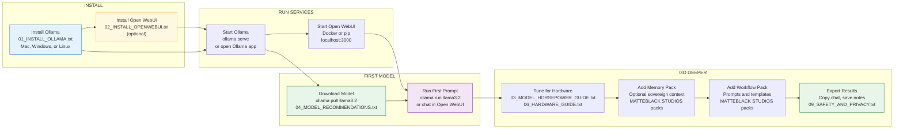
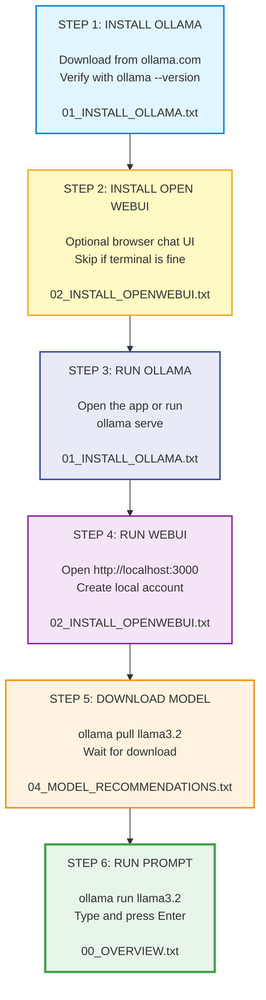

# Sovereign AI Starter Pack — Ollama Edition

**By MATTEBLACK STUDIOS**

> **Disclaimer:** This pack teaches you to run open-source AI models on your own hardware. Model outputs may be inaccurate. Always verify important information. This pack is not legal, medical, or financial advice. You are responsible for how you use AI tools and for complying with model licenses and local laws.

---

## What This Pack Does

The Sovereign AI Starter Pack — Ollama Edition is a beginner-friendly, text-only guide to running AI **locally** on your own computer. Install Ollama, optionally add Open WebUI for a browser chat UI, download a model, and start prompting — with no cloud account, no subscription, and no data leaving your machine by default.

**You do not need to be a developer.** If you can install an app and copy a command into Terminal or PowerShell, you can run local AI.

---

## Who This Is For

- Beginners who want **private, local AI** without cloud lock-in
- Privacy-conscious users who want prompts to stay on their hardware
- Students, writers, and hobbyists exploring open-source models
- Anyone curious about **sovereign compute** before trying advanced workflow packs
- Mac, Windows, and Linux users with modest hardware (8 GB RAM minimum)

If you want ChatGPT-style chat **on your machine**, this pack is your starting line.

---

## Requirements

| Requirement | Minimum | Recommended |
|---|---|---|
| **OS** | macOS 12+, Windows 10/11, or Linux | Latest stable release |
| **RAM** | 8 GB | 16 GB+ |
| **Disk** | 10 GB free | 20 GB+ for multiple models |
| **GPU** | Optional | Apple Silicon or NVIDIA for speed |
| **Internet** | Required for install and first model download | Stable connection for large pulls |
| **Ollama** | [ollama.com/download](https://ollama.com/download) | Latest version |
| **Open WebUI** | Optional — Docker Desktop or pip | Docker method in `02_INSTALL_OPENWEBUI.txt` |

---

## Quick Start

### 1. Install Ollama

Download from **[ollama.com/download](https://ollama.com/download)**, then verify:

```bash
ollama --version
```

Full walkthrough: `01_INSTALL_OLLAMA.txt`

### 2. (Optional) Install Open WebUI

Adds a browser chat UI at `http://localhost:3000`. Ollama works fine from the terminal alone.

Full walkthrough: `02_INSTALL_OPENWEBUI.txt`

### 3. Download and run your first model

```bash
ollama run llama3.2
```

The first run downloads the model. Type a message and press **Enter**. Exit with **Ctrl + C**.

### 4. Read the guides in order

Start with `00_OVERVIEW.txt`, then follow the numbered files. Use `07_TROUBLESHOOTING.txt` if something breaks.

---

## Folder Structure

```
SOVEREIGN_AI_STARTER_PACK_OLLAMA/
├── README.md                      # Product overview (this file)
├── 00_OVERVIEW.txt                # Big picture — start here after README
├── 01_INSTALL_OLLAMA.txt          # Install Ollama (Mac / Windows / Linux)
├── 02_INSTALL_OPENWEBUI.txt       # Optional browser UI (Docker + pip)
├── 03_MODEL_HORSEPOWER_GUIDE.txt  # RAM, GPU, and model size basics
├── 04_MODEL_RECOMMENDATIONS.txt   # Which model to pick first
├── 05_OTHER_POPULAR_TOOLS.txt     # GPT4All, LM Studio, Jan, Kobold
├── 06_HARDWARE_GUIDE.txt          # Hardware limits and upgrades
├── 07_TROUBLESHOOTING.txt         # Problem → fix reference
├── 08_FAQ.txt                     # Quick answers
├── 09_SAFETY_AND_PRIVACY.txt      # Privacy and responsible use
├── 10_CREDITS.txt                 # Tool attribution and links
├── VERSION.TXT                    # Current pack version
├── changelog.txt                  # Release history
├── LICENSE                        # MIT (Modified for Sovereign AI Workflow Packs)
├── CONTRIBUTING.md                # How to open issues and submit improvements
├── SECURITY.md                    # Security reporting and safe-use policy
└── CODE_OF_CONDUCT.md             # Community standards
```

---

## Workflow Visuals

Read left to right. Each box maps to a numbered guide in this pack.

### Full Ollama Starter Workflow



| Step | What you do | File |
|---|---|---|
| Install Ollama | Download and verify the CLI | `01_INSTALL_OLLAMA.txt` |
| Open WebUI | Optional browser chat | `02_INSTALL_OPENWEBUI.txt` |
| Start services | Run Ollama (and WebUI if used) | Guides above |
| Pick a model | Match model to your RAM | `04_MODEL_RECOMMENDATIONS.txt` |
| First prompt | Terminal or WebUI chat | `00_OVERVIEW.txt` |
| Stay private | Local-only habits | `09_SAFETY_AND_PRIVACY.txt` |
| Fix issues | Common errors | `07_TROUBLESHOOTING.txt` |

**Memory and workflow packs** are optional next steps in the MATTEBLACK STUDIOS sovereign AI line — use them once Ollama is running reliably.

### Super Simple (6 Steps)

Six steps. No jargon. If you only remember one picture, remember this one.



**The whole thing in one sentence:** Install Ollama, optionally add WebUI, run both, pull a model, chat — done.

---

## Useful Commands

```bash
ollama list              # show installed models
ollama pull <name>       # download a model
ollama run <name>        # chat with a model
ollama rm <name>         # delete a model
```

### Recommended starter models

| Situation | Command |
|-----------|---------|
| Best first pick | `ollama run llama3.2` |
| 8 GB RAM or want speed | `ollama run mistral` |
| Low-RAM laptop | `ollama run phi3` |
| Coding and logic | `ollama run qwen2.5` |
| Writing and conversation | `ollama run gemma2` |

Too slow or crashing? Try `ollama run phi3` or `ollama run llama3.2:1b`.

---

## Documentation Order

| Step | File | When to open |
|------|------|--------------|
| 1 | `00_OVERVIEW.txt` | Big picture before installing |
| 2 | `01_INSTALL_OLLAMA.txt` | Installing Ollama |
| 3 | `04_MODEL_RECOMMENDATIONS.txt` | Picking or switching models |
| 4 | `02_INSTALL_OPENWEBUI.txt` | Browser chat UI (optional) |
| 5 | `03_MODEL_HORSEPOWER_GUIDE.txt` | RAM, GPU, and model size |
| 6 | `06_HARDWARE_GUIDE.txt` | Hardware limits and upgrades |
| 7 | `09_SAFETY_AND_PRIVACY.txt` | Privacy and responsible use |
| 8 | `05_OTHER_POPULAR_TOOLS.txt` | GPT4All, LM Studio, Jan, and more |
| 9 | `08_FAQ.txt` | Quick questions |
| 10 | `07_TROUBLESHOOTING.txt` | Something is not working |
| 11 | `10_CREDITS.txt` | Tool attribution and links |

Version info: `VERSION.TXT` and `changelog.txt`

---

## Privacy and Sovereign Compute

This pack is built on **local-first, privacy-first** principles:

- **Your prompts stay on your machine** when you use Ollama locally
- **No account required** for basic Ollama use
- **You control models** — install, switch, and delete anytime
- **Offline capable** after models are downloaded

Read `09_SAFETY_AND_PRIVACY.txt` before pasting sensitive data into any AI tool.

---

## Troubleshooting

| Problem | What to try |
|---------|-------------|
| `ollama` command not found | Close terminal, reopen, restart computer |
| Model won't download | Check internet and disk space; run `ollama pull llama3.2` |
| Out of memory | Use `ollama run phi3`; close other apps |
| Very slow replies | Use a smaller model; plug in your laptop |
| Open WebUI won't open | See `02_INSTALL_OPENWEBUI.txt` and `07_TROUBLESHOOTING.txt` |

Full fix list: `07_TROUBLESHOOTING.txt`

---

## Get the Full Pack

**Gumroad:** [https://gumroad.com/l/sovereign-ai-starter-pack-ollama](https://gumroad.com/l/sovereign-ai-starter-pack-ollama) *(placeholder — update with your live product URL)*

The GitHub repo mirrors the product documentation. The Gumroad download is the customer distribution bundle.

---

## Community and Security

- **Report a security issue** → `SECURITY.md` (do not post sensitive reports in public issues)
- **Contribute improvements** → `CONTRIBUTING.md`
- **Community standards** → `CODE_OF_CONDUCT.md`

---

## License

This pack is released under the [MIT License (Modified for Sovereign AI Workflow Packs)](LICENSE). Commercial resale requires written permission from MATTEBLACK STUDIOS.

---

## Support

- **Website:** [matteblackstudios.netlify.app](https://matteblackstudios.netlify.app)
- **Email:** matteblackstudios1@gmail.com

---

*Sovereign AI Starter Pack — Ollama Edition — MATTEBLACK STUDIOS*
*Local-first. Privacy-first. Studio-grade.*
